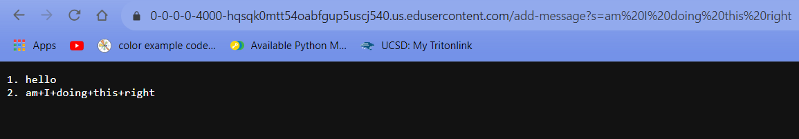
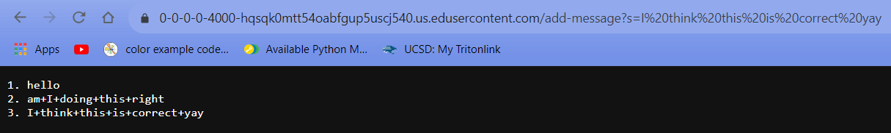
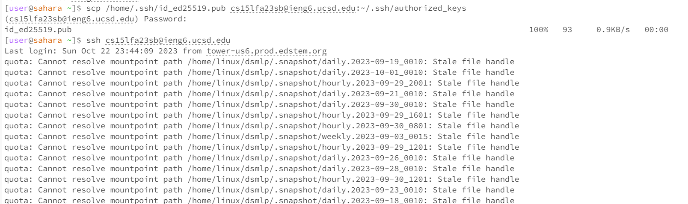
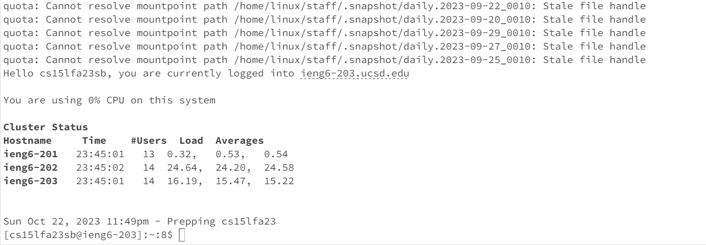
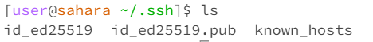

StringServer Code
```
import java.io.IOException;
import java.net.URI;

class Handler implements URLHandler {
    String stringy = "";
    int number = 0;

    public String handleRequest(URI url) {
        if (url.getPath().equals("/")) {
            return String.format(stringy);} else {
            if (url.getPath().contains("/add-message")) {
                String[] parameters = url.getQuery().split("=");
                if (parameters[0].equals("s")) {
                    number = number + 1;
                    stringy = stringy + String.valueOf(number) + ". " + String.valueOf(parameters[1])+"\n";
                    return String.format(stringy);
                }
            }
            return "404 Not Found!";
        }
    }
}

class StringServer {
    public static void main(String[] args) throws IOException {
        if(args.length == 0){
            System.out.println("Missing port number! Try any number between 1024 to 49151");
            return;
        }

        int port = Integer.parseInt(args[0]);

        Server.start(port, new Handler());
    }
}
```
Screenshots of /add-message

Here, the handleRequest method is being used. The only argument is the URI url, and its value is https://0-0-0-0-4000-hqsqk0mtt54oabfgup5uscj540.us.edusercontent.com/add-message?s=am%20I%20doing%20this%20right. It does not change as a result of the request, as it is the argument given and is not changed within the method, only read. There is a new variable created, the String array "parameters", whose contents are "s" and "am I doing this right". Important class variables are String stringy, which is the string tracked, and int number, which is the "number" used to make the next entry of the list. Initially, stringy was "1. hello \n". Initially, number was 1. After the request was rpocessed, stringy was "1. hello \n2. am+I+doing+this+right" and number was 2.

Here, the handleRequest method is being used. The only argument is the URI url, and its value is https://0-0-0-0-4000-hqsqk0mtt54oabfgup5uscj540.us.edusercontent.com/add-message?s=I%20think%20this%20is%20correct%20yay. It does not change as a result of the request, as it is the argument given and is not changed within the method, only read. There is a new variable created, the String array "parameters", whose contents are "s" and "I think this is correct yay". Important class variables are String stringy, which is the string tracked, and int number, which is the "number" used to make the next entry of the list. Initially, stringy was "1. hello \n2. am+I+doing+this+right". Initially, number was 2. After the request was rpocessed, stringy was "1. hello \n2. am+I+doing+this+right \n3. I+think+this+is+correct+yay" and number was 3.
Screenshots



what I learned: I learned to make a new server, and manipulate URLs to make servers do different things with different commands.
